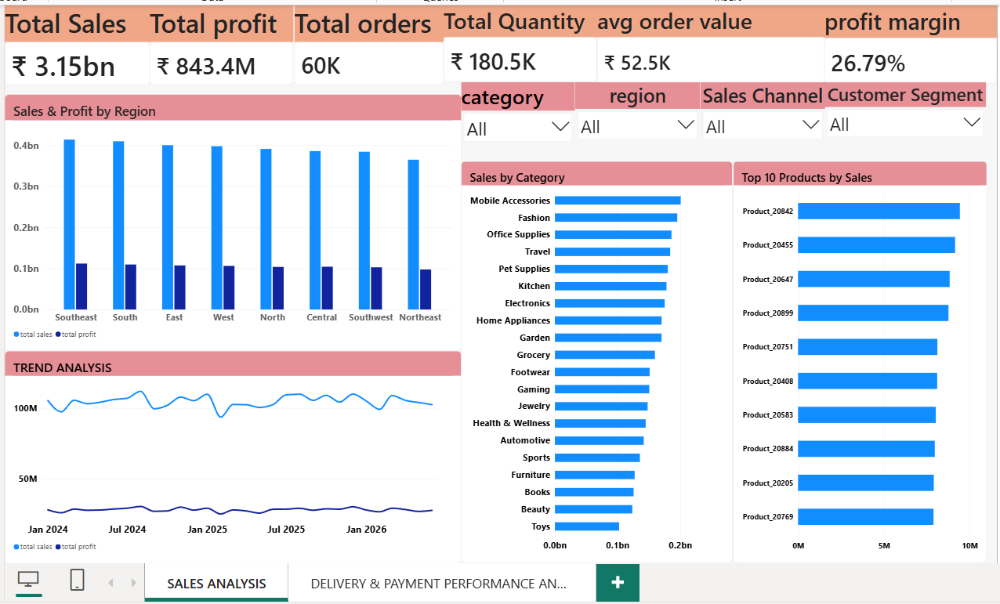
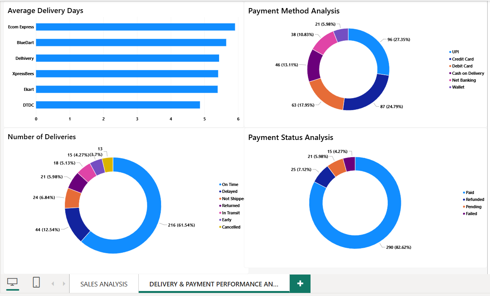

# E-Commerce Sales & Delivery Performance Analysis

## 📌 Project Overview

This project analyzes e-commerce sales and delivery performance using SQL Server, Excel, and Power BI.

The objective of this project is to analyze sales, profit, customer behavior, product performance, seller performance, delivery performance, and payment activity and convert the data into meaningful business insights.

## 🛠️ Tools & Technologies

- SQL Server
- Microsoft Excel
- Power BI
- DAX

## 📂 Dataset

The project contains multiple related tables:

- Customers
- Orders
- Products
- Sellers
- Deliveries
- Payments

## 🔍 SQL Analysis

SQL Server was used for:

- Data analysis
- Joins
- Aggregations
- CTEs
- Subqueries
- Window functions
- RANK and DENSE_RANK
- LAG and LEAD
- Date-based analysis
- SQL Views

### SQL Views Created

- vw_SalesAnalysis
- vw_CustomerAnalysis
- vw_ProductAnalysis
- vw_SellerPerformance
- vw_DeliveryPerformance
- VW_PAYMENTANALYSIS

## 📊 Excel Analysis

Excel was used for:

- Data validation
- Pivot Tables
- Pivot Charts
- KPI analysis
- Slicers
- Interactive dashboard

## 📈 Power BI Dashboard

The Power BI dashboard contains two pages.

### Page 1 — Sales Performance

- Total Sales
- Total Profit
- Total Orders
- Total Quantity
- Average Order Value
- Profit Margin
- Sales & Profit by Region
- Sales by Category
- Top 10 Products
- Monthly Sales & Profit Trend
- Region
- Category
- Sales Channel
- Customer Segment slicers

### Page 2 — Delivery & Payment Performance

- Average Delivery Days
- Delivery Status
- Payment Method Analysis
- Payment Status Analysis

## 🧮 DAX Measures

Important measures created:

- Total Sales
- Total Profit
- Total Orders
- Total Quantity
- Average Order Value
- Profit Margin
- Total Discount

## 💡 Key Business Insights

1. The company generated strong overall sales and profitability.
2. Southeast was one of the strongest-performing regions.
3. Mobile Accessories was the highest-selling category.
4. A small number of products contributed significantly to overall sales.
5. Delivery performance showed opportunities for improvement.
6. Most payments were successfully completed, while failed and pending payments require monitoring.
7. Regional and category-level analysis can help management focus on high-growth opportunities.
8. Delivery partner performance can be improved by monitoring average delivery time and delivery status.

## 🎯 Business Objective

The dashboard helps management:

- Monitor sales and profitability
- Identify high-performing products and categories
- Compare regional performance
- Analyze customer segments
- Monitor delivery performance
- Understand payment behavior
- Make data-driven business decisions

## 📸 Dashboard Preview

### Sales Performance

### Delivery & Payment Analysis

